# Folder Management Module — Enterprise Blueprint

> **Document type:** PRD · Functional Specification · UI/UX Spec · DB Spec · API Spec · QA Spec · Client Documentation
> **Module:** Folder Management (Document Tree, Folder-level Metadata & Permissions)
> **Platform:** Enterprise Common Data Environment (CDE) — modular monolith
> **Status legend:** ✅ As-built (running) · 🟡 Partial (core built, extensions pending) · ⏭ Target (specified, not yet built)
> **Audience:** Product, Engineering (API + Web), UI/UX, QA, DevOps, Client/Implementation
> **Related modules:** [Documents](documents.md) · [Project](project-blueprint.md) · [Organization](organization-blueprint.md) · [RBAC / Roles](rbac-roles.md)

---

## Table of Contents

1. [Module Overview](#1-module-overview)
2. [Business Goals](#2-business-goals)
3. [User Roles](#3-user-roles)
4. [User Stories](#4-user-stories)
5. [Functional Requirements](#5-functional-requirements)
6. [Permission Model](#6-permission-model)
7. [Database Design](#7-database-design)
8. [API Design](#8-api-design)
9. [UI Design](#9-ui-design)
10. [Folder Tree Behaviour](#10-folder-tree-behaviour)
11. [Security Rules](#11-security-rules)
12. [Metadata Management](#12-metadata-management)
13. [Business Rules](#13-business-rules)
14. [Validation Rules](#14-validation-rules)
15. [Workflow](#15-workflow)
16. [Sequence Diagrams](#16-sequence-diagrams)
17. [Flowchart](#17-flowchart)
18. [Entity Relationship Diagram](#18-entity-relationship-diagram)
19. [Folder Permission Resolution Flow](#19-folder-permission-resolution-flow)
20. [Folder Creation Flow](#20-folder-creation-flow)
21. [Metadata Configuration Flow](#21-metadata-configuration-flow)
22. [Folder Upload Behaviour](#22-folder-upload-behaviour)
23. [Audit Logs](#23-audit-logs)
24. [Notifications](#24-notifications)
25. [Performance Considerations](#25-performance-considerations)
26. [Security Considerations](#26-security-considerations)
27. [Edge Cases](#27-edge-cases)
28. [Future Enhancements](#28-future-enhancements)
29. [Acceptance Criteria](#29-acceptance-criteria)
30. [Test Cases](#30-test-cases)
31. [Glossary](#31-glossary)
32. [Appendix](#32-appendix)

---

## 1. Module Overview

### 1.1 What this module is

The **Folder Management Module** is the structural backbone of the CDE's document store. It provides the **hierarchical container system** under which every controlled document, drawing, and uploaded file lives. A folder is far more than a directory: in an enterprise CDE it is the **unit of organization, the unit of access control, and the unit of metadata governance**.

Each folder carries three classes of responsibility:

1. **Containment** — an unlimited-depth tree (`Drawings/Architectural/Level 02/…`) scoped to a single project.
2. **Metadata governance** — folder-level defaults (`docNumberPrefix`, `defaultStatus`, `defaultPurpose`) that auto-derive document attributes on upload, ensuring uniform, audit-grade metadata across thousands of files. *(✅ as-built)*
3. **Access control** *(⏭ target)* — folder-scoped permission grants (to users and roles) that override project-level privileges, allowing fine-grained "who can see / upload / approve in this folder" governance.

### 1.2 Business purpose

In construction and engineering programmes, a single project can accumulate **tens of thousands of documents** across disciplines (Architectural, Structural, MEP), stages (WIP → Shared → Published → Archived), and parties (Client, Consultant, Main Contractor, Subcontractors). Without a disciplined folder structure:

- Documents become unfindable (the "where did the latest rev go?" problem).
- Metadata becomes inconsistent (one user types `For Construction`, another `FC`, another `Issued for Construction`).
- Access leaks occur (a subcontractor sees the client's commercially sensitive folder).
- Numbering collides (two `A-1001`s in the same set).

Folder Management solves all four: it imposes a **governed structure**, **inherited metadata defaults**, **scoped permissions**, and **per-folder uniqueness of Doc Ref**.

### 1.3 How it integrates with the rest of the CDE

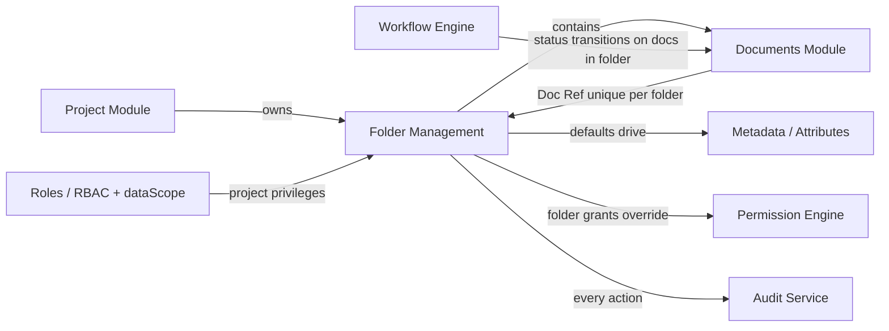

| Integration point | Behaviour |
|---|---|
| **Project** | Every folder belongs to exactly one `projectId`; deleting/archiving a project cascades to its folders. |
| **Documents** | A document's `folderId` is nullable (root = no folder). Folder defaults seed the document's `docNumber` prefix, `status`, and `purposeOfIssue`. **Doc Ref is unique per folder.** |
| **RBAC / dataScope** | Folder visibility is first gated by project membership and the user's data-access scope (`OWN`, `OWN_ORG`, `ALL_ORG`); folder grants then refine within. |
| **Audit** | Create / rename / move / delete / restore / permission-change all append to `audit_logs`. |
| **Workflow** | Folder default status/purpose seed the initial document state that the workflow engine then transitions. |
| **Notifications** | Folder share/permission events and uploads-into-watched-folder can raise notifications. *(⏭ target)* |

---

## 2. Business Goals

### 2.1 Objectives

| # | Objective | Measure of success |
|---|---|---|
| G1 | Impose a **consistent, governed folder structure** per project | 100% of documents live under a folder taxonomy seeded from a project template |
| G2 | **Auto-derive metadata** to eliminate manual, error-prone entry | ≥ 90% of uploads accept folder-derived defaults without override |
| G3 | Guarantee **Doc Ref uniqueness** to prevent register collisions | 0 duplicate Doc Refs within a folder |
| G4 | Provide **fine-grained, folder-scoped access control** | Sensitive folders restricted without restructuring the project |
| G5 | Make documents **findable in < 3 clicks / 1 search** | Median time-to-document below target SLA |
| G6 | Produce **defensible audit trails** for ISO 19650 / contractual disputes | Every structural change attributable to who/when/what |

### 2.2 Problems solved

- **Inconsistent metadata** → folder defaults + controlled vocabularies.
- **Numbering collisions** → per-folder unique Doc Ref with auto-allocation.
- **Access sprawl** → folder-level grants overriding project privileges.
- **Lost documents** → governed hierarchy + breadcrumbs + search/filter.
- **Audit gaps** → append-only logging of all structural mutations.

### 2.3 Expected business value

- **Reduced rework & RFIs** caused by working from superseded/misfiled documents.
- **Faster onboarding** of new project parties via template-seeded structures.
- **Contractual protection** — provable "issued for construction" trails.
- **Compliance** with ISO 19650 CDE state model (WIP / Shared / Published / Archived).

---

## 3. User Roles

> Roles are defined in the [RBAC module](rbac-roles.md). Permissions are strings of the form `module:action`; `*` = superuser. Each role also carries a **data-access scope** (`OWN`, `OWN_ORG`, `ALL_ORG`).

| Role | Responsibilities in this module | Required permissions |
|---|---|---|
| **Super Admin / Tenant Admin** | Full control of all folders across all organizations; configure templates | `*` (dataScope `ALL_ORG`) |
| **Project Administrator** | Create/rename/move/delete folders; set folder defaults; grant folder permissions | `document:create`, `document:update`, `document:delete`, `folder:manage` ⏭ |
| **Document Controller** | Maintain taxonomy, enforce numbering, manage metadata defaults, restore deleted folders | `document:create`, `document:update`, `folder:manage` ⏭ |
| **Discipline Lead / Reviewer** | Browse folders in scope; upload/revise within assigned folders | `document:read`, `document:create`, `document:update` |
| **Contributor (e.g. Subcontractor)** | Browse and upload only within explicitly granted folders | `document:read`, `document:create` (scoped by folder grant) |
| **Viewer / Client** | Read-only browse + download within shared/published folders | `document:read` |
| **Auditor** | Read folder structure + audit logs; no mutation | `document:read`, `audit:read` |

> **As-built note:** Today the module guards on `document:read` / `document:create` / `document:update` / `document:delete`. The dedicated `folder:manage` permission and per-folder ACL grants are **⏭ target** (see [§6](#6-permission-model)).

---

## 4. User Stories

### 4.1 Folder structure (happy paths)

- **US-01** — As a **Project Administrator**, I want to **create a top-level folder** (e.g. `Drawings`), so that documents are organized by discipline.
- **US-02** — As a **Document Controller**, I want to **create nested subfolders to any depth** (`Drawings/Architectural/Level 02`), so that the taxonomy mirrors our delivery structure.
- **US-03** — As a **Project Administrator**, I want to **set a Doc Ref prefix, default status, and default purpose on a folder**, so that uploads into it are auto-numbered and pre-tagged consistently.
- **US-04** — As a **Document Controller**, I want to **rename a folder** without breaking the Doc Refs of documents inside it.
- **US-05** — As a **Project Administrator**, I want to **move a subtree** to reorganize the taxonomy, so that the structure evolves with the project.
- **US-06** — As a **Document Controller**, I want to **soft-delete an empty/obsolete folder and restore it later**, so that mistakes are recoverable.
- **US-07** — As a **Project Administrator**, I want to **seed a project's folder tree from a template**, so that every new project starts compliant. *(⏭ target)*

### 4.2 Permissions (happy paths)

- **US-08** — As a **Project Administrator**, I want to **grant a subcontractor access to only one folder**, so that they cannot see other parties' documents. *(⏭ target)*
- **US-09** — As a **Document Controller**, I want **child folders to inherit parent permissions by default**, so that I configure access once. *(⏭ target)*
- **US-10** — As a **Project Administrator**, I want to **override inherited permissions on a specific subfolder**, so that a sensitive area is locked down. *(⏭ target)*

### 4.3 Upload & metadata (happy paths)

- **US-11** — As a **Discipline Lead**, I want **upload into a folder to pre-fill Doc Ref/status/purpose from folder defaults**, so that I don't retype metadata.
- **US-12** — As a **Contributor**, when **Doc Ref is empty I want an icon I can click to set Doc Ref to the file name**, so that I can quickly adopt the filename as the reference. *(🟡 backend done; UI pending)*
- **US-13** — As a **Document Controller**, I want **Doc Ref enforced unique within the folder**, so that the register never collides.

### 4.4 Edge cases

- **US-E1** — As a **Contributor**, if I try to create a folder with a **name that already exists under the same parent**, I get a clear duplicate-name error.
- **US-E2** — As a **Project Administrator**, if I try to **move a folder into its own descendant**, the system rejects the circular reference.
- **US-E3** — As a **Document Controller**, if I **delete a folder containing documents**, I'm warned and must confirm (or it's blocked unless empty, per policy).
- **US-E4** — As a **Contributor**, if I **upload a blocked file type** (`.exe`, `.php`), the upload is rejected before storage.
- **US-E5** — As a **Reviewer**, if I lack access to a folder, it **does not appear** in my tree (no "exists but denied" leak for listing).
- **US-E6** — As two **Controllers editing the same folder concurrently**, the second save is rejected/merged via optimistic lock rather than silently overwriting.
- **US-E7** — As a **Contributor**, if I provide a **duplicate Doc Ref**, I receive a `409 Conflict` naming the existing Doc Ref.
- **US-E8** — As a **user**, if a folder's **parent is deleted**, the subtree is treated as deleted (cascade soft-delete) and disappears from active views.

---

## 5. Functional Requirements

### FR-1 — Create Folder

- **Purpose:** Add a container (top-level or nested) to a project's tree.
- **Business logic:** Folder belongs to one `projectId` + `tenantId`. Optional `parentId`; `path` is derived from the parent chain. Optional defaults (`docNumberPrefix`, `defaultStatus`, `defaultPurpose`).
- **UI behaviour:** "New Folder" button opens a dialog (name, optional parent, optional defaults). On success the tree refreshes and selects the new folder.
- **Backend behaviour:** Validate project exists; if `parentId` given, validate parent in same project; compute `path`; persist; audit `folder.created`.
- **Validation:** `name` 1–160 chars; `parentId` must be a UUID of an existing folder in the same project; defaults length-limited.
- **Error handling:** `404` project not found; `422` parent not found; `409` duplicate name under same parent *(⏭ target enforcement)*; `400` validation.
- **Audit:** `folder.created` with name, parentId, defaults.

### FR-2 — Rename Folder *(🟡 — endpoint to add; pattern via PATCH)*

- **Purpose:** Change a folder's display name without affecting children's Doc Refs.
- **Business logic:** Rename updates `name`; `path` of descendants recomputed (path stores ancestor names). Existing document `docNumber`s are **immutable** (renaming a folder never rewrites issued Doc Refs).
- **UI behaviour:** Inline rename (double-click) or context-menu → Rename.
- **Backend behaviour:** Bump `version`; recompute descendant `path`; audit old→new.
- **Validation:** Same as create name; uniqueness under parent.
- **Audit:** `folder.renamed` with `{ old, new }`.

### FR-3 — Move Folder *(⏭ target)*

- **Purpose:** Re-parent a folder (and its subtree).
- **Business logic:** New parent must be in the same project; **must not be the folder itself or any descendant** (circular-reference guard). Recompute `path` for the whole subtree.
- **Backend behaviour:** Transactional subtree path update; permission inheritance recalculated; audit `folder.moved`.
- **Validation:** target ≠ self, target ∉ descendants, target in same project, no name clash at destination.
- **Error handling:** `422 CIRCULAR_REFERENCE`; `409` name clash.

### FR-4 — Copy Folder *(⏭ target)*

- **Purpose:** Duplicate a folder structure (optionally with documents) — useful for templated areas.
- **Business logic:** Deep-copy folders + defaults; documents copied as references or fresh records per option; new Doc Refs allocated to preserve per-folder uniqueness.

### FR-5 — Delete Folder (soft)

- **Purpose:** Remove a folder from active views, recoverably.
- **Business logic:** Set `isDeleted = true`. Policy options: (a) block if non-empty, (b) cascade soft-delete subtree + documents with confirmation. Default: **cascade with explicit confirmation**.
- **Backend behaviour:** Transactional cascade; audit `folder.deleted` with descendant count.
- **Error handling:** `409` if policy = block-when-non-empty and folder has children/documents.

### FR-6 — Restore Folder *(⏭ target)*

- **Purpose:** Undelete a soft-deleted folder/subtree.
- **Business logic:** Restore only if parent is active (else restore to root or require parent restore first).
- **Audit:** `folder.restored`.

### FR-7 — List / Browse Folders ✅

- **Purpose:** Return the project's folder tree (scoped to the caller).
- **Backend behaviour:** Filter by `tenantId`, `projectId`, `isDeleted=false`; order by name; **(⏭ target)** filter out folders the caller cannot read.
- **UI behaviour:** Tree with expand/collapse; lazy-load children on expand (target).

### FR-8 — Folder Defaults / Metadata Configuration ✅

- **Purpose:** Configure `docNumberPrefix`, `defaultStatus`, `defaultPurpose` that auto-derive document attributes on upload.
- **Business logic:** On publish, if a field is not supplied by the uploader, the folder default is used; if the folder has none, the project/system default applies (`prefix → project.code`, `status → S0-WIP`, `purpose → For Information`).
- **Validation:** prefix ≤ 40, status ≤ 40, purpose ≤ 60.

### FR-9 — Folder-scoped Permission Grants ✅

- **Purpose:** Grant a folder to a user or role at one of three levels — **view** / **edit (upload)** / **manage** — with child folders inheriting unless overridden.
- **As-built model:** folders are **private by default**; a folder with no grants (and no restricting ancestor) is visible only to its creator and superusers. See [§6](#6-permission-model) and [§19](#19-folder-permission-resolution-flow).

### FR-10 — Doc Ref Governance ✅ (per-folder uniqueness) / 🟡 (filename icon UI)

- **Purpose:** Ensure every document's Doc Ref is unique **within its folder**.
- **Business logic:**
  - If the uploader supplies a Doc Ref, the system checks `(tenantId, projectId, folderId, docNumber, isDeleted=false)`; on collision → `409`.
  - If not supplied, the system auto-allocates the next free `"{prefix}-{NNNN}"` within the folder (`nextFreeDocNumber`).
  - **Filename icon (🟡):** when the Doc Ref field is empty, the upload dialog shows an icon that sets Doc Ref to the selected file's name.
- **Audit:** captured in `document.published` changes.

---

## 6. Permission Model

> **Folders are PRIVATE by default.** A folder is governed by the **nearest self-or-ancestor that has its own grants** (the "source"). If no such folder exists, only the **creator** and **superusers/admins** can see it. Granting a folder makes it independent and its subfolders inherit from it.

### 6.1 Access levels (as-built)

Each grant ties a **principal** (`user` or `role`) to a folder at one **access level** (`FolderPermission.accessLevel`), ranked `view < edit < manage`:

| Level | UI label | Capabilities |
|---|---|---|
| `view` | **Can view** | See the folder and its documents. |
| `edit` | **Can upload** | Also upload documents, add revisions, and edit document metadata. |
| `manage` | **Can manage** | Also change the folder's access (grant/revoke). |

A **module permission** (`document:read` / `document:create` / `document:update`) is still required *in addition* — the folder level scopes *which folders* the module permission applies to. Superusers (`*`) and `document:delete` holders bypass folder ACLs; a folder's **creator** always has `manage` on it.

### 6.2 Resolution (per folder)

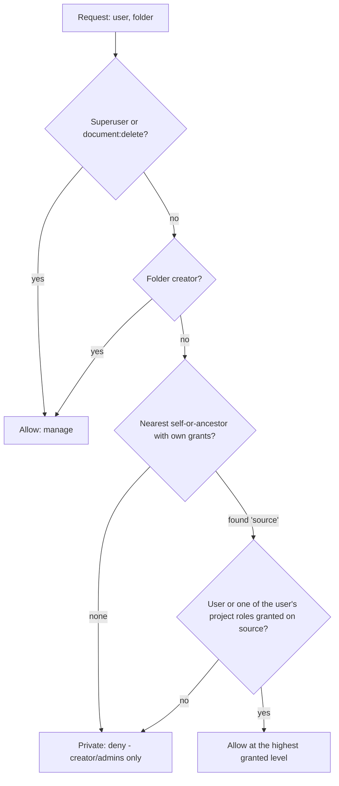

**Rules:**
- **Private by default:** no grants anywhere up the chain ⇒ visible only to creator + admins.
- **Inheritance:** a folder with no own grants follows its nearest ancestor that has grants (computed-at-read). Adding grants to a folder makes it **independent** and its descendants inherit from it.
- **Removing all grants** reverts a folder to inheriting from the nearest ancestor, or to private if none — it does **not** re-open it to everyone.
- **Data scope** is evaluated first via `assertProjectAccess`: a folder whose project is outside the user's scope (`OWN`/`OWN_ORG`) is invisible (404) regardless of grants.
- **Enforcement points:** visibility (folder tree + document register), upload/revise/metadata-edit (require `edit`), and changing access (requires `manage`).

### 6.3 Examples

| Scenario | Resolution |
|---|---|
| Top-level folder, no grants | Only creator + admins see it (private) |
| Folder granted role "Reviewer" at `view` | Everyone holding Reviewer **in this project** can see it, not upload |
| Folder granted user X at `edit` | X can see and upload; others (no grant, no ancestor grant) cannot see it |
| Parent granted, child has no own grants | Child inherits the parent's grants |
| Child later granted its own ACL | Child becomes independent; its subfolders inherit the child |
| Grant added then removed | Reverts to inherited (or private) — not open |
| Folder in another org; user dataScope = `OWN_ORG` | Folder invisible regardless of grants |

> **Permission matrix** appears in the [Appendix](#321-permission-matrix).

---

## 7. Database Design

### 7.1 As-built tables

#### `folders` ✅

| Column | Type | Notes |
|---|---|---|
| `id` | UUID PK | `@default(uuid())` |
| `tenant_id` | UUID | tenant isolation (not null) |
| `project_id` | UUID | owning project (not null) |
| `parent_id` | UUID? | self-reference (null = top-level) |
| `name` | text | 1–160 chars |
| `path` | text | materialized ancestor path, default `/` |
| `doc_number_prefix` | text? | folder default for Doc Ref prefix |
| `default_status` | text? | folder default document status |
| `default_purpose` | text? | folder default purpose of issue |
| `created_by` | UUID? | actor |
| `is_deleted` | bool | soft delete, default false |
| `created_at` | timestamptz | |
| `updated_at` | timestamptz | |

**Indexes:** `@@index([tenantId, projectId, parentId, isDeleted])`.

#### `documents` (folder-relevant columns) ✅

| Column | Type | Notes |
|---|---|---|
| `folder_id` | UUID? | null = project root |
| `doc_number` | text? | **unique per folder** (enforced in app logic) |
| `version` | int | optimistic lock |
| `is_deleted` | bool | soft delete |

**Indexes:** `@@index([tenantId, projectId, folderId, isDeleted])`, `@@index([tenantId, docNumber])`.

### 7.2 Target tables *(⏭)*

#### `folder_permissions` ⏭

| Column | Type | Notes |
|---|---|---|
| `id` | UUID PK | |
| `tenant_id` | UUID | |
| `folder_id` | UUID FK→folders | |
| `principal_type` | enum(`user`,`role`) | |
| `principal_id` | UUID | user or role id |
| `permission` | enum(`read`,`create`,`update`,`delete`,`approve`,`manage`) | |
| `effect` | enum(`allow`,`deny`) | deny wins at equal specificity |
| `inherit` | bool | default true (applies to descendants) |
| `created_by` / `created_at` | | |

**Unique:** `(folder_id, principal_type, principal_id, permission)`.
**Index:** `(tenant_id, folder_id)`, `(principal_type, principal_id)`.

#### `folder_templates` ⏭ / `folder_template_nodes` ⏭

Project-seeding templates (name, list of nodes with relative path + defaults).

### 7.3 Relationships & normalization

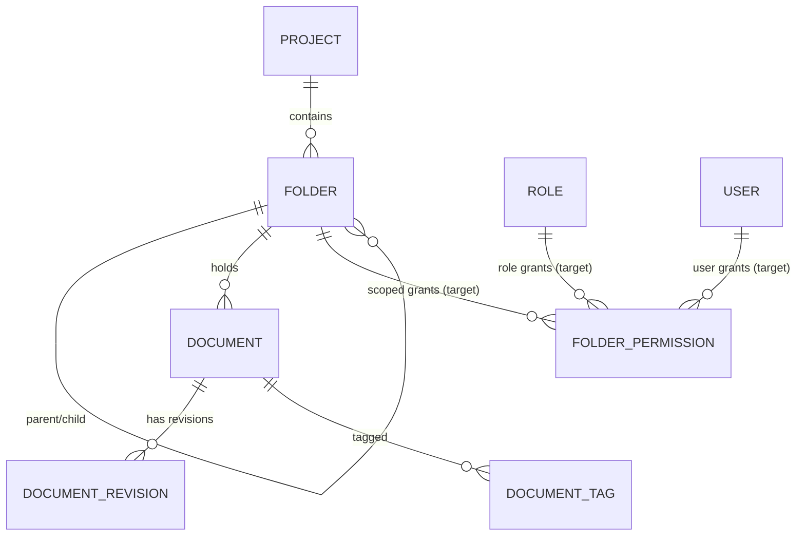

**Normalization recommendations:**
- Keep folder tree in **adjacency list** (`parent_id`) + **materialized `path`** for fast breadcrumb/subtree queries; consider `ltree`/closure-table if very deep trees + frequent subtree moves dominate.
- Do **not** denormalize Doc Ref into folders; uniqueness is enforced against `documents`.
- Permissions in a dedicated table (3NF) — never store comma-lists.

---

## 8. API Design

> Base prefix `/v1`. All routes require `authenticate`. Errors are RFC 7807 `application/problem+json`. Tenant comes from the JWT, never the body.

### 8.1 As-built endpoints ✅

| Method | Path | Permission | Purpose |
|---|---|---|---|
| `GET` | `/projects/:projectId/folders` | `document:read` | List **visible** folders (access-filtered tree) |
| `POST` | `/projects/:projectId/folders` | `document:create` | Create folder (+ defaults) |
| `POST` | `/projects/:projectId/documents/publish` | `document:create` + folder `edit` | Publish doc into folder (auto-derive + Doc Ref uniqueness) |
| `POST` | `/projects/:projectId/documents/:id/revise` | `document:update` + folder `edit` | Add a revision |
| `PATCH` | `/projects/:projectId/documents/:id/attributes` | `document:update` + folder `edit` | Edit document metadata |
| `GET` | `/projects/:projectId/document-register` | `document:read` | Documents in visible folders (+ upload date/author) |
| `GET` | `/projects/:projectId/folder-principals` | `document:read` | Access-picker principals: project members (de-duplicated) + **this project's** roles |
| `GET` | `/projects/:projectId/folders/:id/permissions` | `document:read` | Effective grants (own, or inherited copy) |
| `PUT` | `/projects/:projectId/folders/:id/permissions` | `document:update` + folder `manage` | Replace the folder's own grants |

### 8.2 Target endpoints *(⏭)*

| Method | Path | Permission | Purpose |
|---|---|---|---|
| `PATCH` | `/projects/:projectId/folders/:id` | `folder:manage` | Rename / edit defaults (optimistic lock) |
| `POST` | `/projects/:projectId/folders/:id/move` | `folder:manage` | Re-parent subtree |
| `POST` | `/projects/:projectId/folders/:id/copy` | `folder:manage` | Deep-copy |
| `DELETE` | `/projects/:projectId/folders/:id` | `document:delete` | Soft-delete (cascade) |
| `POST` | `/projects/:projectId/folders/:id/restore` | `folder:manage` | Restore |

### 8.3 Examples

#### Create folder — request

```http
POST /v1/projects/9f.../folders
Authorization: Bearer <jwt>
Content-Type: application/json

{
  "name": "Architectural",
  "parentId": "3a...-drawings",
  "docNumberPrefix": "ARC",
  "defaultStatus": "S0-WIP",
  "defaultPurpose": "For Information"
}
```

#### Create folder — response `201`

```json
{
  "id": "7c2e...-arch",
  "tenantId": "tn_...",
  "projectId": "9f...",
  "parentId": "3a...-drawings",
  "name": "Architectural",
  "path": "/Drawings",
  "docNumberPrefix": "ARC",
  "defaultStatus": "S0-WIP",
  "defaultPurpose": "For Information",
  "isDeleted": false,
  "createdAt": "2026-06-14T09:00:00.000Z"
}
```

#### Validation errors

```json
// 400 VALIDATION_ERROR — name too long
{ "type":"about:blank","title":"Bad Request","status":400,
  "code":"VALIDATION_ERROR","detail":"name: String must contain at most 160 character(s)",
  "instance":"/v1/projects/9f.../folders" }
```

```json
// 422 — parent not in project
{ "title":"Unprocessable Entity","status":422,"code":"UNPROCESSABLE",
  "detail":"Parent folder not found" }
```

#### Publish — duplicate Doc Ref `409`

```json
{ "title":"Conflict","status":409,"code":"CONFLICT",
  "detail":"Doc Ref \"ARC-1001\" already exists in this folder" }
```

#### Folder permissions — `PUT` request *(⏭)*

```json
{
  "grants": [
    { "principalType":"role", "principalId":"role_subcontractor",
      "permission":"read", "effect":"allow", "inherit":true },
    { "principalType":"user", "principalId":"usr_jane",
      "permission":"delete", "effect":"deny", "inherit":true }
  ]
}
```

---

## 9. UI Design

### 9.1 Screen: Document Register / Folder Browser

The folder browser is the left rail; the document register is the main panel.

```
┌──────────────────────────────────────────────────────────────────┐
│ Document Register                      [🗂️ New Folder] [⬆️ Upload] │
│ Project ▸ Drawings ▸ Architectural                  (breadcrumbs)  │
├───────────────┬──────────────────────────────────────────────────┤
│ FOLDER TREE   │  Doc Ref   Title          Status      Revision    │
│ ▾ 📁 Drawings │  ARC-1001  Floor Plan L2  S2-Shared   Published   │
│   ▾ 📁 Arch   │  ARC-1002  Section A-A    S0-WIP       —           │
│     📁 L01    │  …                                                 │
│     📁 L02 ◀  │                                                    │
│   ▸ 📁 Struct │                                                    │
│ ▸ 📁 Contracts│                                                    │
└───────────────┴──────────────────────────────────────────────────┘
```

### 9.2 Dialogs & Forms

**New Folder dialog** ✅ — fields: `Folder name*`, `Doc Ref prefix (auto-numbering)`, `Default status` (select), `Default purpose of issue` (select). Buttons: `Cancel`, `Create folder`.

**Upload dialog** ✅/🟡 — drag-drop zone + Select File; attributes: Folder (drives Doc Ref/defaults), **Doc Ref (with filename icon — 🟡 pending)**, Doc Title, Revision, Purpose of Issue, Status, Revision Notes, Secondary File. Buttons: `Cancel`, `Upload`.

**Doc Ref field with filename icon (🟡 target UI):**
```
Doc Ref  [ ____________________ ] [🏷️]   ← icon enabled when file selected & field empty;
                                            click → fills field with file name
```

**Folder Permissions dialog** ⏭ — principal picker (user/role), permission checkboxes (read/create/update/delete/approve/manage), allow/deny toggle, "apply to subfolders" switch, inheritance indicator.

### 9.3 Buttons, icons, context menu

| Element | Behaviour |
|---|---|
| `🗂️ New Folder` | Opens New Folder dialog |
| `⬆️ Upload` | Opens Upload dialog |
| Folder **right-click** ⏭ | New subfolder · Rename · Move · Copy · Permissions · Delete · Restore |
| Expand/collapse chevron | Toggles child visibility (lazy-load ⏭) |
| `🏷️` filename icon 🟡 | Sets Doc Ref = file name when empty |

### 9.4 Validation messages (inline)

- "Folder name is required."
- "Folder name must be 1–160 characters."
- "A folder with this name already exists here."
- "File type not allowed: …"
- "Doc Ref \"X\" already exists in this folder."

### 9.5 Navigation, breadcrumbs, search, filters

- **Breadcrumbs** reflect the selected folder path (`Project ▸ Drawings ▸ Architectural`); each segment clickable.
- **Search** by Doc Ref / Title / tag, scoped to current folder or whole project (toggle).
- **Filters:** status, purpose of issue, discipline/type, date range, uploader.

---

## 10. Folder Tree Behaviour

| Capability | Status | Behaviour |
|---|---|---|
| **Hierarchy** | ✅ | Adjacency list (`parent_id`) + materialized `path`. |
| **Unlimited nesting** | ✅ | No depth cap (practical guard recommended, e.g. ≤ 30). |
| **Expand / collapse** | 🟡 | Client toggles; full tree currently returned in one list. |
| **Lazy loading** | ⏭ | Fetch children on expand for very large trees. |
| **Drag & drop** | ⏭ | Drag node onto target → calls Move endpoint; circular-ref guarded. |
| **Move folder** | ⏭ | Re-parent subtree; recompute paths transactionally. |
| **Copy folder** | ⏭ | Deep copy (optionally with documents); new Doc Refs allocated. |
| **Delete** | 🟡 | Soft delete; cascade policy with confirmation. |
| **Restore** | ⏭ | Undelete subtree if parent active. |

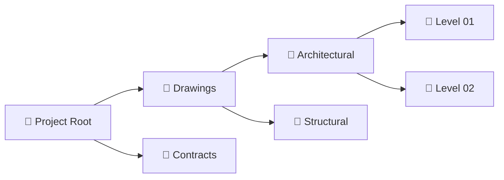

---

## 11. Security Rules

| Rule | Detail |
|---|---|
| **Tenant isolation** | Every query filters `tenant_id` from the JWT; never trust body/param tenant. |
| **Data scope first** | Folder visible only if its project is within the user's `OWN`/`OWN_ORG`/`ALL_ORG` scope. |
| **Private by default** ✅ | A folder with no grants (and no restricting ancestor) is visible only to its creator + admins — never open to everyone. |
| **Inheritance** ✅ | Children inherit the nearest ancestor's grants until given their own (computed-at-read). |
| **Level enforcement** ✅ | `view` = see; `edit` = upload/revise/edit metadata; `manage` = change access. Enforced server-side at each endpoint. |
| **Public folders** ⏭ | A folder may be flagged public-within-project (all members read). |
| **Public links** ⏭ | Time-boxed, optionally password-protected, token URLs to a folder/file; revocable; audited on access. |
| **Private files** ⏭ | Uploader-only visibility until shared/published. |
| **Admin rules** | `*` superuser (and `document:delete` holders) bypass folder ACL; still fully audited. |
| **Creator rules** | A folder's creator always retains `manage` on it. |
| **Permission resolution** | See [§19](#19-folder-permission-resolution-flow). |

---

## 12. Metadata Management

### 12.1 Inheritance

- A document inherits **Doc Ref prefix**, **default status**, **default purpose** from its folder. If the folder has none, the **project/system** defaults apply (`prefix→project.code`, `status→S0-WIP`, `purpose→For Information`). ✅

### 12.2 Customization

- Folder defaults are configurable at create/edit. ⏭ Target: tenant-level controlled vocabularies (status set, purpose set) so dropdowns are governed, not free-text.

### 12.3 Filtering & default values

- Upload form pre-selects folder defaults; user may override per upload. ✅
- Register filters by status/purpose/type/date. 🟡

### 12.4 Attribute validation

- Status ∈ controlled set; purpose ∈ controlled set (⏭ hard-enforce); Doc Ref unique per folder ✅; blocked file extensions rejected ✅.

### 12.5 Upload behaviour & synchronization

- On publish: derive missing attributes → validate → store file (checksum + size) → create `documents` + first `document_revisions` in a transaction → set `current_revision_id` → audit. ✅
- **Synchronization:** changing a folder default affects **future** uploads only — never retroactively mutates existing documents' issued metadata. ✅ (by design)

---

## 13. Business Rules

> Each rule is independently testable.

- **BR-001** A folder belongs to exactly one project and one tenant.
- **BR-002** A folder may have zero or one parent; null parent = top-level.
- **BR-003** Folder depth is unlimited (recommended practical guard ≤ 30).
- **BR-004** Folder `name` is 1–160 characters.
- **BR-005** Folder names are **unique under the same parent** (case-insensitive). *(⏭ enforce)*
- **BR-006** A folder cannot be moved into itself or any of its descendants (no cycles).
- **BR-007** `path` is always the materialized ancestor chain and is recomputed on create/rename/move.
- **BR-008** Deleting a folder is a **soft delete**; cascade to descendants + contained documents (with confirmation).
- **BR-009** A soft-deleted folder is hidden from all active listings.
- **BR-010** Restoring a folder requires its parent to be active (or restore to root).
- **BR-011** **Doc Ref is unique per folder** (root counts as a folder for this purpose).
- **BR-012** If Doc Ref is not provided, the system allocates the next free `"{prefix}-{NNNN}"` within the folder.
- **BR-013** Doc Ref prefix = folder `docNumberPrefix`, else `project.code`.
- **BR-014** Renaming a folder never rewrites existing documents' Doc Refs.
- **BR-015** Folder defaults seed only **new** uploads; existing documents are untouched.
- **BR-016** Blocked file extensions (`.exe`, `.php`, `.htaccess`, `.bat`, `.cmd`, `.sh`, `.com`, `.msi`) are rejected before storage.
- **BR-017** Every structural mutation writes an append-only audit entry.
- **BR-018** Folder visibility respects the caller's data-access scope before any folder ACL.
- **BR-019** Folder permission **deny** overrides **allow** at equal specificity.
- **BR-020** Child folders inherit parent permissions unless they override (⏭).
- **BR-021** Superuser (`*`) bypasses folder ACL but is still audited.
- **BR-022** Concurrent folder edits are guarded by optimistic `version`.

---

## 14. Validation Rules

| Condition | Message | Severity | Recovery |
|---|---|---|---|
| `name` empty | "Folder name is required." | Error | Enter a name |
| `name` > 160 | "Folder name must be 1–160 characters." | Error | Shorten name |
| Duplicate name under parent | "A folder with this name already exists here." | Error | Choose another name |
| `parentId` not in project | "Parent folder not found." (422) | Error | Pick valid parent |
| Move into descendant | "Cannot move a folder into its own subfolder." (422) | Error | Choose another target |
| Delete non-empty (block policy) | "Folder is not empty. Move or delete its contents first." (409) | Error | Empty folder or confirm cascade |
| Doc Ref duplicate in folder | "Doc Ref \"X\" already exists in this folder." (409) | Error | Use another Doc Ref / let system allocate |
| Blocked file type | "File type not allowed: <file>." (422) | Error | Choose an allowed file |
| `docNumberPrefix` > 40 | "Prefix must be ≤ 40 characters." | Error | Shorten prefix |
| Stale `version` (concurrent edit) | "This folder was changed by someone else. Reload and retry." (409) | Warning | Reload + reapply |
| No `read` on folder | Folder simply not listed | Info | Request access |

---

## 15. Workflow

### 15.1 Create folder (step-by-step)

1. **User** clicks *New Folder*, fills name (+ optional parent/defaults), submits.
2. **Browser** POSTs to `/projects/:id/folders` with bearer token.
3. **API** authenticates → checks `document:create` → validates schema (Zod) → asserts project exists → resolves parent + computes `path`.
4. **Database** inserts the folder row.
5. **Audit Service** writes `folder.created`.
6. **API** returns `201` with the folder.
7. **Browser** refreshes the tree, selects the new folder.
8. **Notifications** ⏭ optionally notify folder watchers.

### 15.2 Upload into folder (step-by-step)

1. User selects folder + file + attributes; if Doc Ref empty, may click 🏷️ to use filename.
2. Browser POSTs multipart to `/documents/publish`.
3. API authenticates → `document:create` → drains multipart → blocks disallowed types → derives missing attributes from folder defaults → checks Doc Ref uniqueness in folder (or auto-allocates).
4. Storage saves the buffer (checksum + size).
5. Database (transaction): create `documents`, create first `document_revisions`, set `current_revision_id`.
6. Audit `document.published`.
7. API returns `201`; register refreshes.

---

## 16. Sequence Diagrams

### 16.1 Create folder

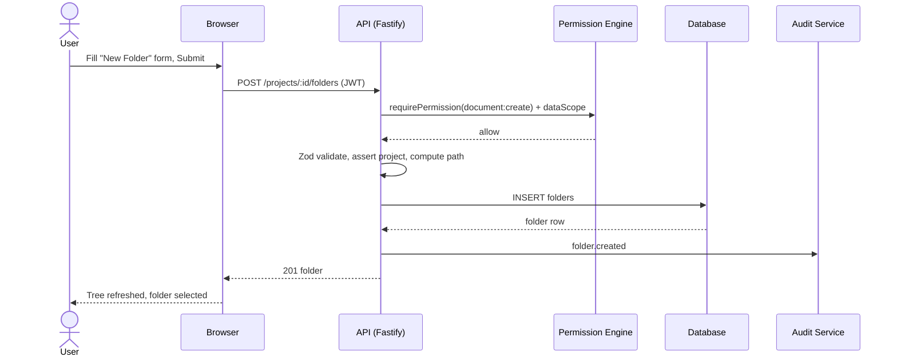

### 16.2 Upload with per-folder Doc Ref uniqueness

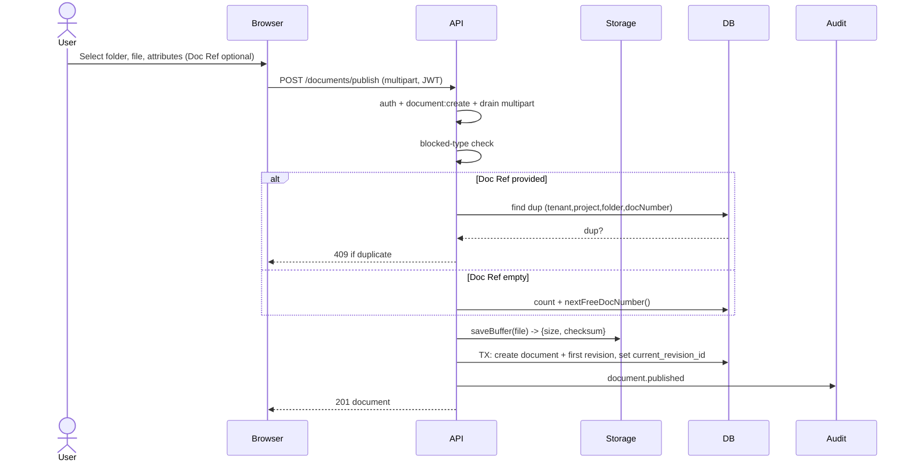

### 16.3 Permission resolution *(⏭)*

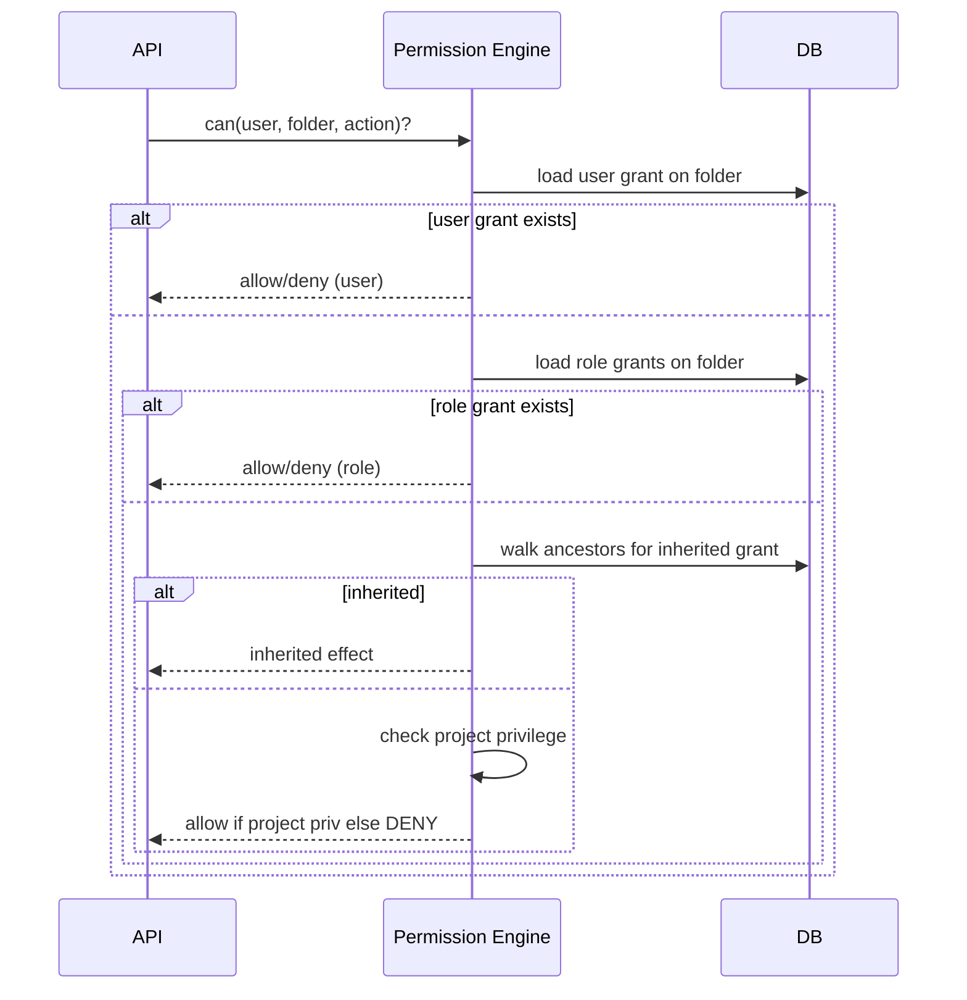

---

## 17. Flowchart

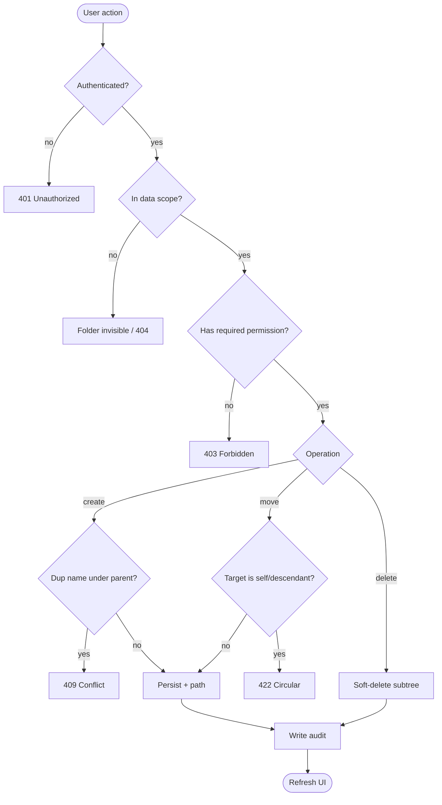

---

## 18. Entity Relationship Diagram

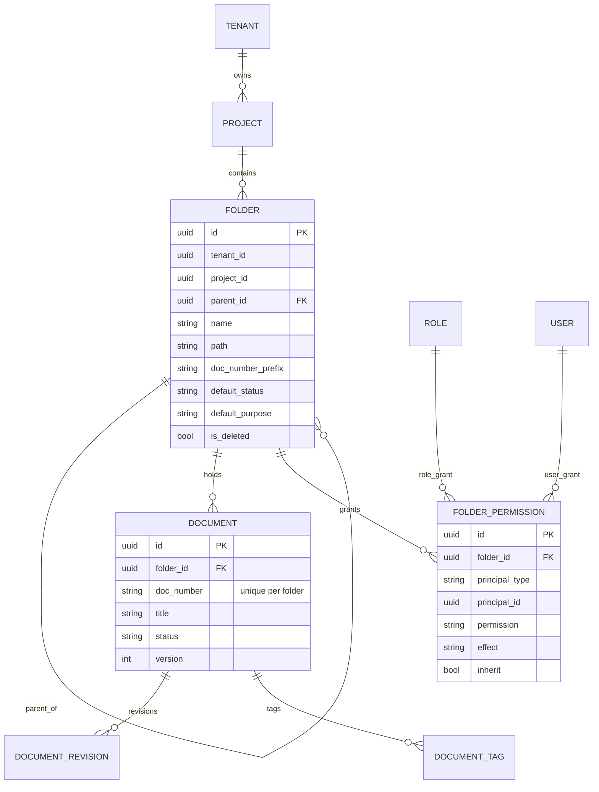

---

## 19. Folder Permission Resolution Flow

**As-built (private-by-default, level-based):** resolve the **source** = nearest self-or-ancestor folder that has its own grants, then read the user's highest granted level on it. No source ⇒ private (creator/admins only). Required level: `view` to see, `edit` to upload/revise/edit, `manage` to change access.

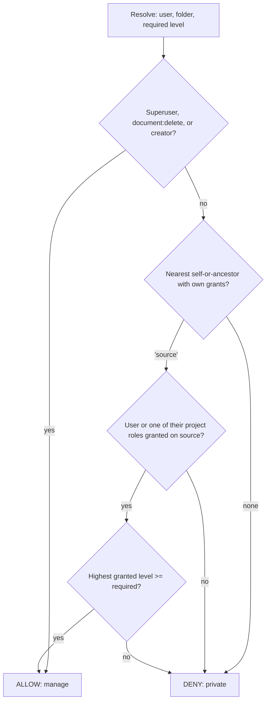

> **Note:** Data scope (`assertProjectAccess`) is checked first — an out-of-scope project yields 404 before ACLs are consulted. Superuser `*` and `document:delete` holders short-circuit to ALLOW (still audited).

---

## 20. Folder Creation Flow

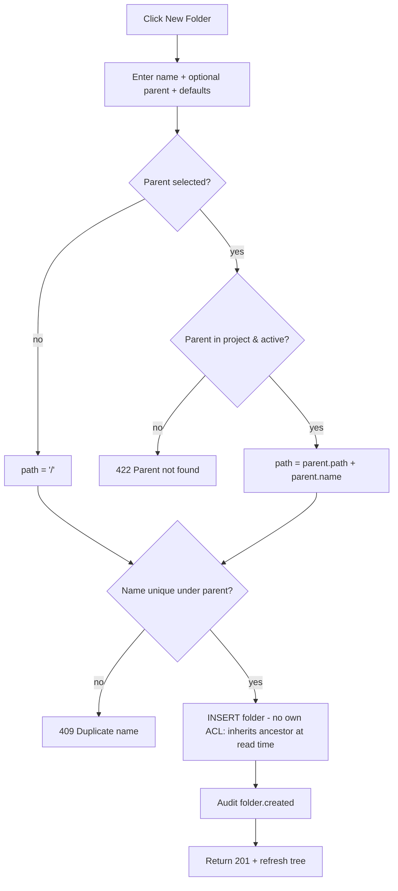

- **Parent folder:** validated to be in same project and active.
- **Subfolder:** `path` derived from parent chain; with no own grants it inherits the nearest ancestor's ACL at read time. ✅
- **Inheritance:** child uses ancestor permissions until given its own; a top-level folder with no grants is private (creator/admins only). ✅
- **Validation:** name length + uniqueness + parent validity.

---

## 21. Metadata Configuration Flow

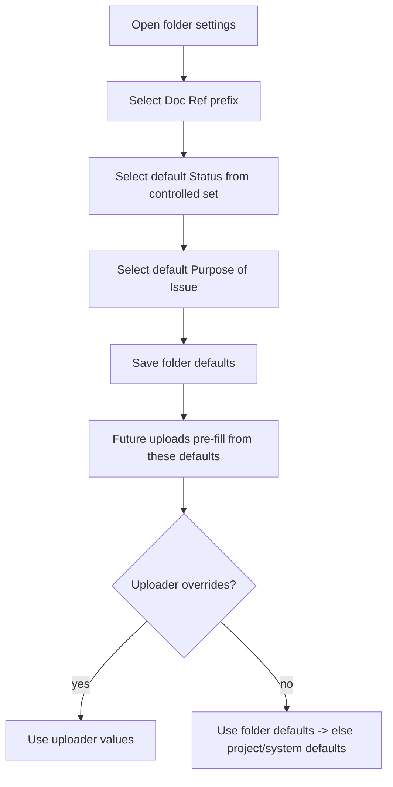

- **Selecting attributes:** prefix, status, purpose.
- **Filtering values:** dropdowns sourced from controlled vocabularies (⏭).
- **Default values:** applied on upload when uploader leaves a field blank.
- **Upload behaviour:** defaults are seeds, not locks (uploader may override unless field is locked — ⏭).

---

## 22. Folder Upload Behaviour

| Step | Behaviour | Status |
|---|---|---|
| Metadata loading | Upload form loads folder defaults (prefix/status/purpose) | ✅ |
| Permission validation | `document:create` on project + folder grant (⏭) | ✅ / ⏭ |
| Blocked-type check | Reject `.exe/.php/...` before storage | ✅ |
| Doc Ref handling | Provided → uniqueness check (409 on dup); empty → auto-allocate; 🏷️ filename icon (🟡) | ✅ / 🟡 |
| Private file settings | Uploader-only until shared | ⏭ |
| AI processing / OCR | `ocr_text` column reserved; pipeline pending | ⏭ |
| Email processing | Upload-by-email into folder | ⏭ |
| Public links | Tokenized shareable links | ⏭ |
| Persistence | Transactional document + first revision + checksum/size | ✅ |
| Audit | `document.published` | ✅ |

---

## 23. Audit Logs

Every action appends to append-only `audit_logs` with: **who** (`userId`), **when** (`createdAt`), **what** (`action`, `resourceType`, `resourceId`), **old/new** (`changes`), **ip**, and (⏭) **device/user-agent**, plus `X-Request-Id` correlation.

| Action | Logged data |
|---|---|
| `folder.created` ✅ | name, parentId, defaults |
| `folder.renamed` ⏭ | `{ old, new }` |
| `folder.moved` ⏭ | `{ oldParent, newParent }` |
| `folder.deleted` ⏭ | descendant count |
| `folder.restored` ⏭ | restored subtree |
| `folder.permission.changed` ⏭ | principal, permission, old→new effect |
| `document.published` ✅ | docNumber, title, revisionLabel, status, purpose |
| `document.revised` ✅ | revisionLabel |

---

## 24. Notifications

| Event | Email | In-App | Webhook | Status |
|---|---|---|---|---|
| Folder shared / permission granted | ✓ | ✓ | ✓ | ⏭ |
| Document uploaded into watched folder | ✓ | ✓ | ✓ | ⏭ |
| Folder deleted/restored | — | ✓ | ✓ | ⏭ |
| Public link accessed | ✓ (owner) | ✓ | ✓ | ⏭ |
| Doc Ref conflict on bulk import | ✓ | ✓ | — | ⏭ |

---

## 25. Performance Considerations

- **Caching:** cache the per-user resolved folder tree (with permissions) per project; invalidate on structural/permission change.
- **Lazy loading:** load children on expand for large trees (⏭).
- **Bulk operations:** batch moves/permission updates in a single transaction; debounce drag-drop.
- **Indexes:** `(tenant_id, project_id, parent_id, is_deleted)` on folders; `(tenant_id, project_id, folder_id, is_deleted)` and `(tenant_id, doc_number)` on documents; `(folder_id, principal_*)` on grants (⏭).
- **Permission evaluation:** precompute effective grants per folder (closure/materialized) to avoid ancestor walks on every read.
- **Materialized `path`** enables O(1) breadcrumb and prefix-match subtree queries.

---

## 26. Security Considerations

- **OWASP A01 Broken Access Control:** enforce permission + dataScope server-side on every endpoint; never rely on UI hiding.
- **OWASP A03 Injection:** parameterized queries via Prisma; Zod validation at the edge.
- **Authorization:** tenant pinned from JWT; folder/project ownership validated against tenant before mutation.
- **Data-leak prevention:** denied folders are **omitted from listings** (no "exists-but-denied" enumeration); 404 vs 403 chosen to avoid leaking existence where required.
- **Permission-escalation prevention:** users cannot grant permissions exceeding their own; `folder:manage` required to edit grants.
- **Audit integrity:** append-only, no update/delete on `audit_logs`; correlation IDs; (⏭) hash-chaining for tamper evidence.
- **Upload safety:** extension blocklist + (⏭) MIME sniffing + (⏭) AV scan; path-traversal guard in storage key sanitization.
- **Public links:** signed, expiring tokens; revocation list; rate-limited.

---

## 27. Edge Cases

| # | Edge case | Handling |
|---|---|---|
| EC-1 | **Permission conflict** (role allow vs user deny) | Deny wins (more specific / deny precedence) |
| EC-2 | **Deleted parent folder** | Subtree cascade soft-deleted; hidden from active views |
| EC-3 | **Inherited metadata changes** after upload | Existing docs unchanged; only future uploads affected |
| EC-4 | **Duplicate folder names** under same parent | 409; case-insensitive comparison (⏭ enforce) |
| EC-5 | **Circular reference** on move | 422 rejected (target ≠ self/descendant) |
| EC-6 | **Concurrent edits** | Optimistic `version`; second writer gets 409 |
| EC-7 | **Duplicate Doc Ref** in folder | 409 naming the existing ref |
| EC-8 | **Auto Doc Ref exhaustion** | `nextFreeDocNumber` scans up to 100k; else 409 |
| EC-9 | **Move folder with documents** | Doc `folderId` follows; Doc Refs unchanged but uniqueness re-checked at destination (⏭) |
| EC-10 | **Restore into deleted parent** | Blocked until parent restored / restore to root |
| EC-11 | **Blocked file in secondary slot** | Rejected like primary |
| EC-12 | **Very deep nesting** | Practical guard; lazy load to protect UI |
| EC-13 | **Root-level documents** (`folderId = null`) | Treated as a folder for uniqueness scope |

---

## 28. Future Enhancements

- **Folder templates** for one-click compliant project setup.
- **Versioning & retention policies** per folder (auto-archive, legal hold).
- **AI classification / auto-tagging** of uploads by content.
- **OCR** populating `ocr_text` for full-text search.
- **Bulk permission updates** across subtrees with preview/diff.
- **Automation rules** ("when status → S4, move to Published/Archived").
- **Drag-drop move/copy** with optimistic UI.
- **Public/expiring share links** with watermarking.
- **Upload-by-email** into a folder address.
- **Closure-table** storage for very large/deep trees.

---

## 29. Acceptance Criteria

- **AC-1** A user with `document:create` can create a top-level and nested folder; both appear in the tree with correct `path`. ✅
- **AC-2** Creating a folder with defaults causes a subsequent upload to pre-fill prefix/status/purpose. ✅
- **AC-3** Uploading with a Doc Ref already present in the folder returns `409` naming the existing ref. ✅
- **AC-4** Uploading without a Doc Ref allocates the next free `"{prefix}-{NNNN}"` unique within the folder. ✅
- **AC-5** When Doc Ref is empty and a file is selected, the filename icon fills Doc Ref with the file name. 🟡
- **AC-6** Blocked file types are rejected with `422` before any storage write. ✅
- **AC-7** Every folder create/upload writes an audit entry attributable to the actor. ✅
- **AC-8** A folder outside the user's data scope is not listed. (🟡 list-scoping to finish)
- **AC-9** Moving a folder into its own descendant is rejected with `422`. ⏭
- **AC-10** Soft-deleted folders disappear from active listings and are restorable. ⏭
- **AC-11** Folder-scoped grants override project privileges per the precedence rules. ⏭

---

## 30. Test Cases

### 30.1 Functional

| ID | Steps | Expected |
|---|---|---|
| TC-F1 | Create top-level folder "Drawings" | 201; appears at root, `path=/` |
| TC-F2 | Create subfolder under Drawings | 201; `path=/Drawings` |
| TC-F3 | Create folder with prefix ARC + defaults | Upload into it pre-fills ARC/status/purpose |
| TC-F4 | List folders | Returns active folders ordered by name |

### 30.2 Negative

| ID | Steps | Expected |
|---|---|---|
| TC-N1 | Create folder, empty name | 400 VALIDATION_ERROR |
| TC-N2 | Create folder, name > 160 | 400 |
| TC-N3 | Create with bad `parentId` | 422 parent not found |
| TC-N4 | Upload `.exe` | 422 blocked type |

### 30.3 Permission

| ID | Steps | Expected |
|---|---|---|
| TC-P1 | User without `document:create` creates folder | 403 |
| TC-P2 | User dataScope OWN_ORG lists folders of other org's project | not listed |
| TC-P3 | Folder user-deny vs role-allow (⏭) | denied |
| TC-P4 | Superuser any action | allowed + audited |

### 30.4 Performance

| ID | Scenario | Target |
|---|---|---|
| TC-PF1 | List 5,000-folder tree | < 500 ms (with lazy load ⏭) |
| TC-PF2 | Resolve permissions for deep folder | < 50 ms with precompute |

### 30.5 Security

| ID | Scenario | Expected |
|---|---|---|
| TC-S1 | Forge tenantId in body | ignored; JWT tenant used |
| TC-S2 | Path traversal in filename `../../etc` | sanitized key |
| TC-S3 | Enumerate denied folder by id | 404/omitted, no leak |

### 30.6 Boundary

| ID | Scenario | Expected |
|---|---|---|
| TC-B1 | name exactly 160 chars | accepted |
| TC-B2 | prefix exactly 40 chars | accepted; 41 rejected |
| TC-B3 | 30-level nesting | accepted |

### 30.7 Concurrency

| ID | Scenario | Expected |
|---|---|---|
| TC-C1 | Two renames of same folder | second gets 409 stale version (⏭) |
| TC-C2 | Two uploads same Doc Ref | one 201, other 409 |

---

## 31. Glossary

| Term | Meaning |
|---|---|
| **CDE** | Common Data Environment — single source of truth for project information (ISO 19650). |
| **Folder** | Hierarchical container scoped to a project; carries metadata defaults and (target) permissions. |
| **Doc Ref / Doc Number** | Human-readable document reference, unique **within a folder**. |
| **Purpose of Issue** | Why a revision is issued (For Information, For Construction, …). |
| **Status (suitability)** | CDE state code (S0-WIP, S1–S4 Shared, A-Authorized …). |
| **Revision** | A versioned file + attributes attached to a document. |
| **Data scope** | Cross-cutting visibility level: OWN / OWN_ORG / ALL_ORG. |
| **Inheritance** | Child folders adopt ancestor permissions/metadata unless overridden. |
| **Soft delete** | Logical deletion (`is_deleted=true`) that is recoverable. |
| **Optimistic lock** | Concurrency control via a `version` counter. |
| **Materialized path** | Stored ancestor chain enabling fast tree queries. |

---

## 32. Appendix

### 32.1 Permission matrix

| Action | Viewer | Contributor | Discipline Lead | Doc Controller | Project Admin | Super Admin |
|---|:--:|:--:|:--:|:--:|:--:|:--:|
| Browse folders (read) | ✅ | ✅ (granted) | ✅ | ✅ | ✅ | ✅ |
| Create folder | — | — | — | ✅ | ✅ | ✅ |
| Rename folder | — | — | — | ✅ | ✅ | ✅ |
| Move/Copy folder | — | — | — | ✅ | ✅ | ✅ |
| Delete folder | — | — | — | ✅ | ✅ | ✅ |
| Restore folder | — | — | — | ✅ | ✅ | ✅ |
| Set folder defaults | — | — | — | ✅ | ✅ | ✅ |
| Manage folder permissions | — | — | — | ✅ (scoped) | ✅ | ✅ |
| Upload / publish | — | ✅ (granted) | ✅ | ✅ | ✅ | ✅ |
| Revise document | — | ✅ (granted) | ✅ | ✅ | ✅ | ✅ |
| Download | ✅ | ✅ | ✅ | ✅ | ✅ | ✅ |

### 32.2 Sample API payloads

**Create nested folder**
```json
POST /v1/projects/{projectId}/folders
{ "name":"Level 02", "parentId":"{archId}", "docNumberPrefix":"ARC-L02",
  "defaultStatus":"S0-WIP", "defaultPurpose":"For Information" }
```

**Publish with explicit Doc Ref**
```
POST /v1/projects/{projectId}/documents/publish   (multipart/form-data)
file=@FloorPlan.pdf
folderId={archId}
docNumber=ARC-1001
title=Floor Plan Level 02
revisionLabel=P01
purposeOfIssue=For Review
status=S1-Shared
revisionNotes=Initial issue
```

**Set folder permissions (⏭)**
```json
PUT /v1/projects/{projectId}/folders/{id}/permissions
{ "grants":[
  {"principalType":"role","principalId":"role_sub","permission":"read","effect":"allow","inherit":true},
  {"principalType":"role","principalId":"role_sub","permission":"create","effect":"allow","inherit":true}
]}
```

### 32.3 Folder hierarchy example

```
/ (project root)
├── Drawings/                 prefix=DWG, default=S0-WIP, purpose=For Information
│   ├── Architectural/        prefix=ARC
│   │   ├── Level 01/
│   │   └── Level 02/         → ARC-1001, ARC-1002 (unique within this folder)
│   └── Structural/           prefix=STR
├── Specifications/           prefix=SPEC
├── Contracts/                (restricted: client + PM only)
└── Correspondence/
```

### 32.4 Metadata examples

| Folder | docNumberPrefix | defaultStatus | defaultPurpose |
|---|---|---|---|
| Drawings/Architectural | ARC | S0-WIP | For Information |
| Specifications | SPEC | S2-Shared | For Review |
| Contracts | CON | A-Authorized | For Approval |

### 32.5 Best practices

- Seed every project from a **standard folder template** for cross-project consistency.
- Keep **prefixes short and disciplined** (`ARC`, `STR`, `MEP`).
- Configure **folder defaults once**; let uploads inherit — minimize manual metadata.
- Grant permissions at the **highest sensible folder** and rely on inheritance.
- Prefer **deny at a specific subfolder** over restructuring the whole tree.
- Never reuse a Doc Ref; let the system **auto-allocate** when unsure.
- Treat folder structure changes as **audited governance events**, not casual edits.

---

> **As-built vs target summary:** Folder create/list, folder-default-driven metadata derivation, per-folder Doc Ref uniqueness, blocked-type enforcement, and audit are **running today**. The filename→Doc Ref icon is **backend-ready, UI pending**. Folder rename/move/copy/delete/restore endpoints, folder-scoped ACL grants with inheritance, lazy loading, drag-drop, templates, public links, and OCR/AI are **specified here as the target roadmap**.
